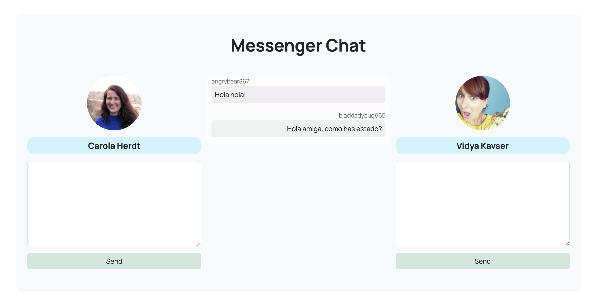

# Desafío API REST Vue

Aplicar conocimientos del consumo de API’s, construyendo una aplicación de chat, en donde los usuarios se cargan de forma aleatoria de la API RandomUser.me, y cada uno tiene un color específico asignado para sus mensajes. La aplicación está dividida en componentes que gestionan la lógica de usuario, el envío de mensajes y la visualización del chat.

## Estructura del Proyecto

El proyecto está dividido en tres componentes principales:

`MessengerChat.vue`: El componente principal que contiene la lógica general de la aplicación. Este componente maneja la obtención de usuarios y la gestión de mensajes.

`UserChat.vue`: Componente que representa la interfaz de usuario para cada participante en el chat. Permite a los usuarios escribir y enviar mensajes.

`ChatBoxShow.vue:` Componente que muestra la lista de mensajes enviados por ambos usuarios en el chat.

### Requisitos

- **VueJs**
- **Axios** para consumo de API
- **Bootstrap** para diseño de la interfaz
- **RandomUser.me** API para obtener usuarios
- **Google Fonts**

---

### Autores

- **Desarolladora:[Paloma Rivera](https://github.com/**SingularPigeon)\*\*
- **Diseño: [Bootcamp Desafío Latam](desafiolatam.com)**
